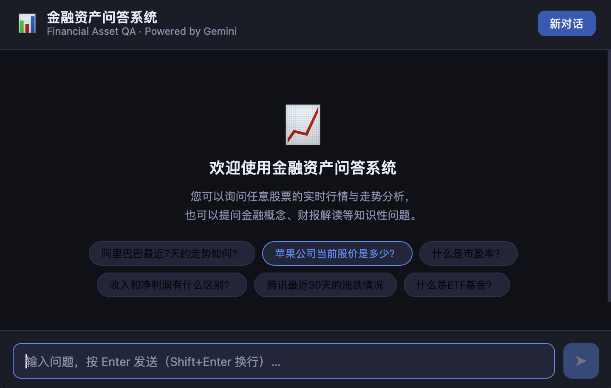

# 🤖 Financial Asset QA System — 金融资产问答系统

<p align="center">
  
</p>

<p align="center">
  <a href="https://www.youtube.com/watch?v=BBjlg-sMpcE"><strong>Demo 演示</strong></a>
  &nbsp;&nbsp;|&nbsp;&nbsp;
  <a href="https://zqhhhhhh.github.io/zqhhhhhh/#/project"><strong>Portfolio 作品集</strong></a>
</p>

---

## 🧩 系统架构

```
用户输入
   │
   ▼
┌─────────────────────────────────────────────────────────────┐
│                      FastAPI 后端                            │
│                                                              │
│  ┌──────────────┐                                            │
│  │ RouterService│  LLM 意图分类（Intent 1 / 2 / 3）          │
│  └──────┬───────┘                                            │
│         │                                                    │
│    ┌────┴────────────────────────────┐                       │
│    │                                 │                       │
│    ▼ Intent 1                        ▼ Intent 2              │
│  ┌────────────────┐      ┌──────────────────────────────┐   │
│  │  AssetService  │      │         RAGService            │   │
│  │                │      │                               │   │
│  │ TickerResolver │      │  ① FinancialReportService     │   │
│  │ (LLM + alias)  │      │    yfinance 季度/年度财报      │   │
│  │                │      │    SEC EDGAR (美股)            │   │
│  │ NewsService    │      │    CNINFO (A股)               │   │
│  │ Finnhub API    │      │                               │   │
│  │ yfinance 日线  │      │  ② FAISS 向量检索             │   │
│  │                │      │    sentence-transformers       │   │
│  │ LLM 分析生成  │      │    327 篇 Wikipedia 知识库      │   │
│  └────────────────┘      │                               │   │
│                          │  ③ DuckDuckGo Web Search      │   │
│                          └──────────────────────────────┘   │
│                                                              │
│  ┌──────────────────────┐                                    │
│  │   SessionService     │  多轮对话历史管理                    │
│  └──────────────────────┘                                    │
│                                                              │
│  ┌──────────────────────┐                                    │
│  │     LLMService       │  Gemini 2.5 Flash                  │
│  │  (Google Gemini API) │  支持 thinking_budget 控制          │
│  └──────────────────────┘                                    │
└─────────────────────────────────────────────────────────────┘
               │
               ▼
      React 前端（Vite）
      聊天界面 + 行情卡片 + 新闻列表 + 财报链接
```

### 🔄 请求处理流程

**Intent 1 — 资产行情**
```
用户问题 → TickerResolver（LLM + alias cache）→ 解析 ticker
         → DateRangeExtractor（LLM）→ 解析查询时间段
         → yfinance 拉取日线/分钟级行情
         → Finnhub / yfinance 拉取新闻（最多 200 条）→ 相关度排序 top5
         → LLM 生成【事实】+【分析】
```

**Intent 2 — 金融知识 / 财报**
```
用户问题 → is_report_query() 判断
    ├── 财报类 → FinancialReportService
    │            → yfinance 季度/年度财务数据（含同比/环比预计算）
    │            → SEC EDGAR / CNINFO 原文链接
    │            → LLM 生成结构化分析报告
    └── 知识类 → FAISS 向量检索（cosine 相似度）
                  ├── 命中（score ≥ 0.28）→ LLM 基于知识库回答
                  └── 未命中 / 无关 → DuckDuckGo Web Search → LLM 总结
```

---

## 🛠️ 技术选型说明

| 模块 | 技术 | 选型原因 |
|------|------|----------|
| LLM | Gemini 2.5 Flash | 免费额度充足，支持 thinking_budget 关闭推理节省 token，中文理解能力强 |
| 向量检索 | FAISS (IndexFlatIP) + sentence-transformers | 本地部署无延迟，`paraphrase-multilingual-MiniLM-L12-v2` 支持中英双语语义检索 |
| 行情数据 | yfinance | 覆盖美股/港股/A股，免费无需 API key，支持分钟级与日线级数据 |
| 新闻数据 | Finnhub API | 提供公司级新闻 + 发布时间，支持日期范围过滤；yfinance 作为备用 |
| 财报数据 | yfinance 财务报表 | 季度/年度利润表，自动回退（季度数据稀少时改用年报） |
| 财报原文链接 | SEC EDGAR REST API | 免费，覆盖全部美股 10-K/10-Q，通过 CIK 号检索，无需 key |
| A股财报链接 | CNINFO POST API | 巨潮资讯官方接口，覆盖沪深两市 |
| Web Search | DuckDuckGo (`ddgs`) | 无 API key，开箱即用，作为知识库未命中时的兜底 |
| 后端框架 | FastAPI + Uvicorn | 异步支持，自动生成 OpenAPI 文档，类型安全 |
| 前端 | React 18 + Vite | 轻量，开发体验好，满足聊天 UI 需求 |
| 知识库构建 | Wikipedia API (Category) | 自动发现金融分类下所有词条，无需手动列清单，可一键重建 |

---

## 🧠 Prompt 设计思路

系统中共有 6 类 Prompt，每类针对不同任务单独设计：

### 1. 意图路由 Prompt（RouterService）
**目标**：以最低 token 消耗准确分类用户意图（1/2/3）。

设计要点：
- 提供带标注的正例（`'苹果今天股价' → 1`）避免模糊边界
- `max_tokens=10`，`thinking=False`，响应极快
- 关键词 fallback 保证 LLM 不可用时仍可运行

### 2. Ticker 解析 Prompt（TickerResolverService）
**目标**：从自然语言（"腾讯"、"黄金"、"纳斯达克"）提取标准 ticker 代码。

设计要点：
- 列举覆盖美股、港股、A股、指数、商品、加密货币的 alias 规则
- 系统要求只返回纯 ticker 字符串，避免额外解释
- 配合正则校验过滤格式非法结果（防幻觉）

### 3. 日期范围提取 Prompt（AssetService）
**目标**：将"最近7天"、"去年3月"等表述转换为 `{"start":"...", "end":"..."}` JSON。

设计要点：
- 动态注入今日日期（`_build_period_prompt()`，函数而非模块常量，避免日期冻结）
- 覆盖"今天/本周/一年/具体历史日期"等边界场景
- `temperature=0`，`max_tokens=80`，纯提取任务

### 4. 资产行情分析 Prompt（AssetService）
**目标**：生成"事实 + 分析"两段式专业金融评述。

设计要点：
- 明确分工：【事实】只陈述数据，【分析】发挥 LLM 金融知识
- 禁止在正文输出 URL（链接由前端单独渲染）
- `thinking=False`，`max_tokens=2000`，允许较长分析

### 5. 财报分析 Prompt（RAGService）
**目标**：基于财务数字生成结构化分析报告。

设计要点：
- 强制三段式结构：【基本信息】→【核心财务指标】→【分析】
- 同比/环比数字由 Python 预计算后注入上下文，禁止 LLM 自行计算（防编造）
- 严格禁止出现"您提供的"、"知识库"等暴露系统内部的用语
- `max_tokens=1500` 防截断

### 6. 知识库 / Web Search 回答 Prompt（RAGService）
**目标**：基于检索内容回答，不得凭空捏造。

设计要点：
- 检索内容全部注入上下文，要求 grounded 回答
- KB 无关时返回固定信号 `[KB_MISS]`，由代码捕获后降级到 Web Search（避免用户看到"暂未找到"）
- Web Search 结果要求标注来源标题，末尾加"以上内容来自网络搜索，仅供参考"

---

## 📊 数据来源说明

| 数据类型 | 来源 | 覆盖范围 | 限制 |
|----------|------|----------|------|
| 实时/历史股价 | yfinance | 美股、港股、A股、ETF、指数、商品、加密货币 | 数据可能有 15min 延迟 |
| 公司新闻 | Finnhub `company-news` API | 美股为主 | 需要 API Key（免费层有限额） |
| 新闻备用 | yfinance `news` | 覆盖范围同股价 | 数量较少 |
| 季度/年度财报数据 | yfinance `quarterly_income_stmt` / `income_stmt` | 美股季度、港股/A股年度 | 港股季度数据稀少，自动回退年报 |
| 美股财报原文链接 | SEC EDGAR REST API | 全部在美上市公司 10-K/10-Q | 无 |
| A股财报原文链接 | CNINFO POST API | 沪深两市上市公司 | 部分公司历史文件需登录 |
| 港股财报链接 | 暂无可靠 API | — | HKEXnews 搜索为 JS 表单，无法构造静态链接 |
| 金融知识 | 中文 Wikipedia（Category API）| 327 篇词条，覆盖 18 个金融分类 | 内容静态，需定期重建（运行 `scripts/build_knowledge.py`） |
| Web Search 兜底 | DuckDuckGo (`ddgs`) | 全网 | 结果质量不稳定，为最后一道防线 |

---

## 🚀 本地部署

### 🔑 第一步：获取 API Key

**Gemini API Key（必须）**
1. 访问 [Google AI Studio](https://aistudio.google.com/app/apikey)
2. 登录 Google 账号 → 点击 **Create API Key**
3. 复制生成的 key（格式：`AIza...`）

**Finnhub API Key（可选，用于更丰富的新闻数据）**
1. 访问 [finnhub.io](https://finnhub.io) → 免费注册
2. 进入 Dashboard → 复制 **API Key**
3. 不配置时系统自动回退到 yfinance 新闻，功能不受影响

---

### 📁 第二步：克隆项目并配置环境变量

```bash
git clone https://github.com/your-username/Financial_Asset_QA_System.git
cd Financial_Asset_QA_System
```

在 `backend/` 目录下创建 `.env` 文件：

```bash
cd backend
cp .env.example .env   # 如果没有 .env.example，直接新建
```

用任意文本编辑器打开 `backend/.env`，填入：

```
GEMINI_API_KEY=AIza...（你的 Gemini Key）
FINNHUB_API_KEY=...（可选）
```

---

### ⚙️ 第三步：启动后端

> 需要 Python 3.11+，建议使用虚拟环境。

```bash
# 在 backend/ 目录下
python -m venv venv

# macOS / Linux
source venv/bin/activate

# Windows
venv\Scripts\activate

# 安装依赖
pip install -r requirements.txt

# 构建金融知识库（首次运行必须，约需 5 分钟）
python scripts/build_knowledge.py

# 启动后端服务
uvicorn app.main:app --reload --port 8000
```

看到 `Application startup complete` 表示后端已就绪。

---

### 🎨 第四步：启动前端

> 需要 Node.js 18+，新开一个终端窗口执行。

```bash
cd frontend
npm install
npm run dev
```

---

### 🌐 第五步：打开浏览器

前端启动后，终端会显示本地地址，默认为：

```
http://localhost:5173
```

在浏览器中打开即可使用。后端 API 文档可访问：

```
http://localhost:8000/docs
```

---

### 📋 环境要求

| 依赖 | 最低版本 |
|------|----------|
| Python | 3.11+ |
| Node.js | 18+ |
| pip | 23+ |

### 🔐 环境变量说明

| 变量 | 必须 | 说明 |
|------|------|------|
| `GEMINI_API_KEY` | 是 | Google AI Studio 获取，免费 |
| `FINNHUB_API_KEY` | 否 | finnhub.io 注册，免费层够用；不配置则回退 yfinance 新闻 |

---

## ⚡ 快速启动（已配置过环境后）

```bash
# 后端（backend/ 目录）
source venv/bin/activate
uvicorn app.main:app --reload --port 8000

# 前端（frontend/ 目录，新终端）
npm run dev
```

---

## 💡 优化与扩展思考

### ✅ 已实现的优化

**资产行情分析：新闻驱动，分析有据可查**
- 资产行情查询同步拉取 Finnhub / yfinance 相关新闻（最多 200 条），经相关度排序后全量喂给 LLM
- LLM 的走势分析基于真实新闻事件，而非模型自由生成，规避凭空捏造涨跌原因
- 前端仅展示相关度最高的 top5 条新闻（含标题、来源、日期、链接），避免信息过载

**财报来源：按市场路由至官方平台**
- 识别股票所属市场，分别从官方渠道获取财报链接，保证数据权威性：
  - 美股 → SEC EDGAR 免费 REST API（10-K / 10-Q 原文链接，无需 API Key）
  - A股 → 巨潮资讯网 CNINFO（沪深两市上市公司公告）
  - 港股 → HKEXnews 无开放 REST API（JS 表单驱动，无法构造静态链接），以 Yahoo Finance 财务页作为可靠兜底
- 所有市场同步提供 yfinance 结构化财务数据（营收、净利润、EBITDA 等），链接与数字双轨呈现

**数据质量**
- 涨跌幅计算以区间前一交易日收盘价为基准（与 Robinhood/Yahoo 口径一致），而非区间首日收盘价
- 财报同比/环比由 Python 预计算注入，LLM 不做数学，杜绝编造增速

**LLM 效率**
- 短提取任务（意图分类、日期解析、季度数量解析）全部 `thinking=False`，节省 token

### 🔭 可扩展方向

**数据层**
- 接入 Tushare Pro，补充港股/A股结构化财报数据（目前 yfinance 港股季度数据稀少）
- 解析 SEC EDGAR 原始 10-K/10-Q 文档（MD&A 段落），实现真正的财报全文 RAG，而非仅展示链接
- 接入 Alpha Vantage / Polygon.io 获取盘前/盘后数据

**功能层**
- 多轮追问记忆：记住上一条查询的公司，支持"那它的财报呢？"式追问
- 历史走势图表：前端渲染 echarts/recharts，直观展示价格曲线
- 多资产对比：同时查询两支股票并对比关键指标
- 用户收藏 / 自定义监控列表

**工程层**
- Redis 缓存 ticker 解析结果和近期股价（减少 yfinance 请求次数）
- 流式响应（SSE），LLM 生成内容逐字输出，提升感知速度

---

## 📁 项目结构

```
Financial_Asset_QA_System/
├── backend/
│   ├── app/
│   │   ├── main.py                  # FastAPI 入口，路由定义
│   │   ├── schemas.py               # 请求/响应数据模型
│   │   ├── core/config.py           # 环境变量配置
│   │   └── services/
│   │       ├── chat_service.py      # 请求编排（ChatOrchestrator）
│   │       ├── router_service.py    # 意图分类
│   │       ├── asset_service.py     # 资产行情 + LLM 分析
│   │       ├── rag_service.py       # RAG 三层检索
│   │       ├── financial_report_service.py  # 财报 API 整合
│   │       ├── news_service.py      # 新闻拉取 + 相关度排序
│   │       ├── ticker_resolver.py   # 公司名 → ticker 解析
│   │       ├── llm_service.py       # Gemini API 封装
│   │       ├── session_service.py   # 多轮对话历史
│   │       └── web_search_service.py # DuckDuckGo 搜索
│   ├── data/knowledge/              # 327 篇 Wikipedia 金融知识库
│   ├── scripts/
│   │   └── build_knowledge.py       # 知识库构建脚本（手动 + 分类自动发现）
│   ├── logs/                        # LLM 调用日志 + 应用日志
│   └── requirements.txt
└── frontend/
    ├── src/
    │   ├── App.jsx                  # 主界面（聊天 + 行情卡片 + 财报链接）
    │   └── index.css
    └── package.json
```
